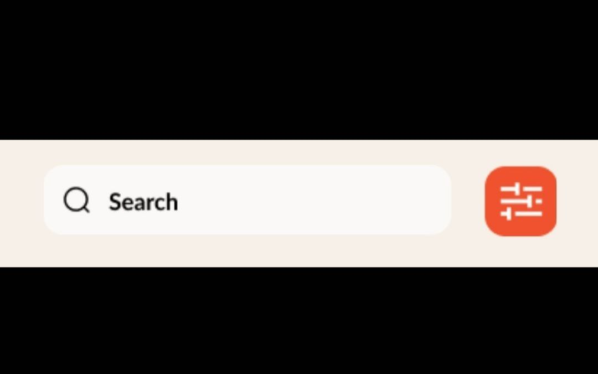
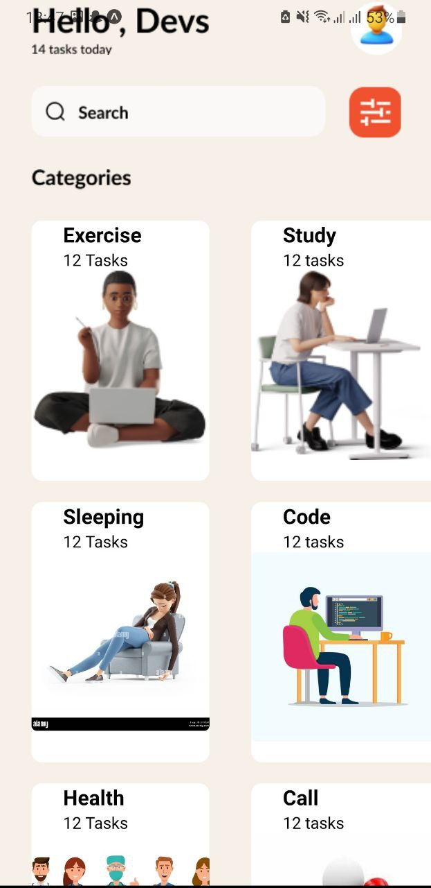
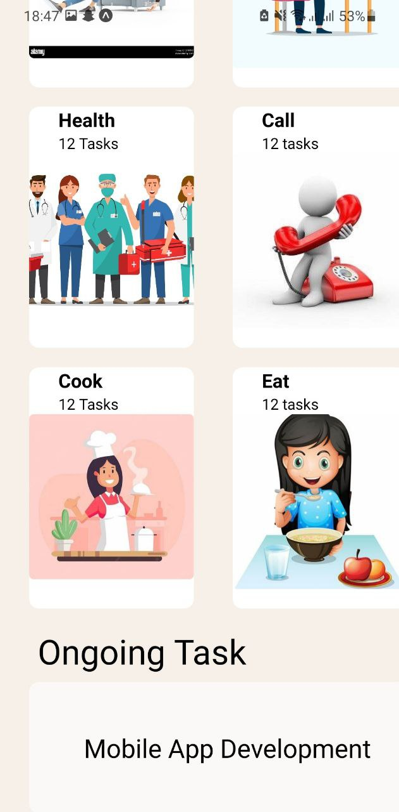
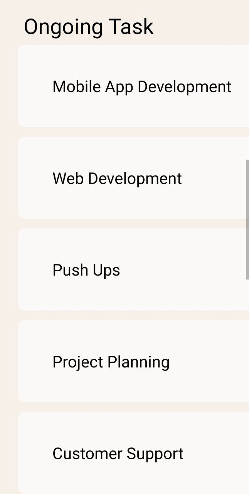
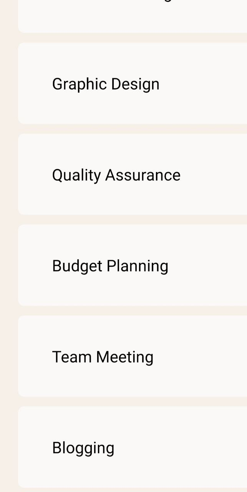
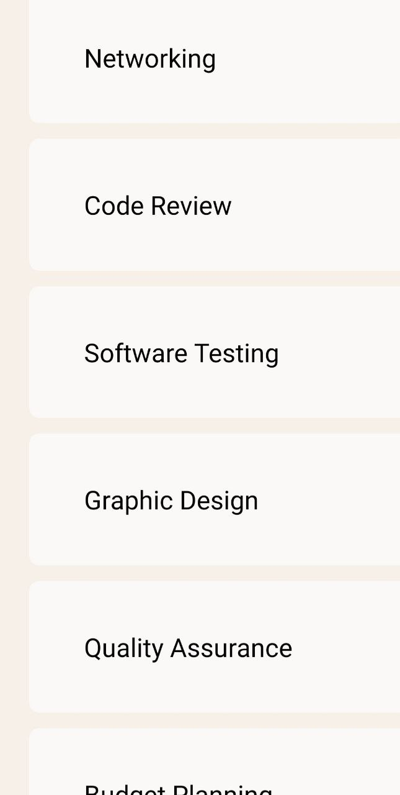

Student ID: 11263775

Description:
This app is designed to help users manage their tasks well and track their daily chores. The tasks are organised by the app and presented in a simple manner.

 Components:
1. Header: The header shows a greeting to the user and number of the tasks of the day. It also includes an icon for the user profile.

Screenshot:

2.Searchbar: The searchbar provides a search input field which allows users to search for tasks.

Screenshot:

3.Categories: In this component an category card is displayed with an image,title and number of tasks.

For example: the title being Exercise,Cook etc in addition to the number of tasks then the image.
Screenshot:

4.Taskcard: This component displays the ongoing tasks in a list.

Screenshot:

